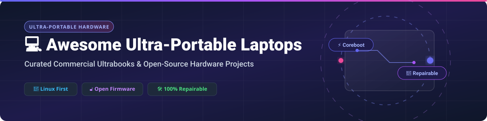

  

# 💻 Awesome Ultra-Portable Laptop Hardware Ecosystem

> **A comprehensive, SEO-optimized directory of top commercial ultrabooks, Linux-first laptops, repairable hardware ecosystems, and open-source DIY cyberdecks.**

---

## 📌 Table of Contents
- [📊 Market & Industry Overview](#-market--industry-overview)
- [🏢 Commercial & SaaS Laptop Platforms](#-commercial--saas-laptop-platforms)
- [⚡ Open-Source GitHub Repositories & Hardware Projects](#-open-source-github-repositories--hardware-projects)
- [🛠️ How to Contribute](#-how-to-contribute)
- [💖 Support & Sponsorship](#-support--sponsorship)
- [📈 Star History](#-star-history)
- [⚠️ Disclaimer](#-disclaimer)

---

## 📊 Market & Industry Overview

> 📈 **Sector Market Size & Concentration Analysis:**  
> The global **ultra-portable laptop and premium ultrabook market** is valued at approximately **$72.4 Billion USD** (growing at a ~7.8% CAGR). The market structure is **moderately concentrated among a few global tech giants** (Apple, Lenovo, Dell, HP, Asus, Samsung), while the specialized **open-firmware and repairable niche** is expanding rapidly through innovative disrupters such as System76 and Framework.

---

## 🏢 Commercial & SaaS Laptop Platforms

Below is a comparative breakdown of top commercial ultra-portable laptop platforms, sorted by **company market valuation / revenue in descending order**:

| 💻 Product Name | 🏢 Manufacturer / Vendor | 📊 Company Scale (Valuation / Revenue) | 💰 Pricing (Starting Tier) | 🎁 Free Tier / Trial Limit | 🔑 Key Focus & Repairability |
| :--- | :--- | :--- | :--- | :--- | :--- |
| **[Apple MacBook Air M2](https://www.apple.com/macbook-air/)** 🍏 | Apple Inc. | **~$3.30 Trillion Market Cap** | **$999 USD** (Base 8GB RAM / 256GB SSD) | **14-Day Return Window & Free Today at Apple Workshops** | Benchmark performance & battery life; **closed hardware** with soldered RAM/SSD. |
| **[Microsoft Surface Laptop Go 3](https://www.microsoft.com/surface)** 🪟 | Microsoft Corp. | **~$3.10 Trillion Market Cap** | **$799 USD** (Base Core i5 / 8GB / 256GB) | **60-Day Price Protection & Free Surface Support** | Lightweight compact Windows laptop; replaceable SSD & display assembly. |
| **[Samsung Galaxy Book3](https://www.samsung.com/galaxy-book/)** 📱 | Samsung Electronics | **~$380 Billion Market Cap** | **$849 USD** (Base Core i5 / 8GB / 256GB) | **15-Day Trial / Free Galaxy Ecosystem Cloud Sync** | Premium AMOLED display ultrabook; Windows ecosystem integration. |
| **[HP Pavilion Aero 13](https://www.hp.com/pavilion-aero/)** 💻 | HP Inc. | **~$35 Billion Market Cap** | **$679 USD** (Base AMD Ryzen 5 / 16GB / 512GB) | **15-Day Return Window & 1-Year HP Care Support** | Sub-1 kg ultra-light Ryzen laptop; soldered memory, replaceable M.2 SSD. |
| **[Dell XPS 13](https://www.dell.com/xps13)** 🖥️ | Dell Technologies | **~$82 Billion Market Cap** | **$1,099 USD** (Base Intel Core Ultra 5 / 16GB) | **30-Day Return Window & Free Basic Mail-in Service** | Compact InfinityEdge design; high performance, soldered LPDDR5X RAM. |
| **[Lenovo ThinkPad X1 Nano](https://www.lenovo.com/thinkpad-x1-nano)** 💼 | Lenovo Group | **~$15 Billion Market Cap** | **$1,249 USD** (Base Core i5 / 16GB / 512GB) | **30-Day Return Window & Free Lenovo Vantage Diagnostics** | Sub-1 kg business ultrabook with best-in-class keyboard durability. |
| **[ASUS Zenbook S 13 OLED](https://www.asus.com/zenbook-s-13-oled/)** 🎨 | ASUStek Computer | **~$12 Billion Market Cap** | **$1,399 USD** (Base Core Ultra 7 / 32GB / 1TB) | **30-Day Return Window & 1-Year Accidental Damage Protection** | Featherweight 1 kg 2.8K OLED ultrabook; soldered high-density RAM. |
| **[Acer Swift Air 14](https://www.acer.com/swift-air/)** ✈️ | Acer Inc. | **~$3.5 Billion Market Cap** | **$699 USD** (Base Intel Core Series 3 / 16GB) | **15-Day Return Window & Standard Customer Support** | Affordable 1.25 kg ultra-portable with 19-hour battery life. |
| **[Fujitsu Lifebook UH-X](https://www.fujitsu.com/lifebook-uh-x/)** 🇯🇵 | Fujitsu Ltd. | **~$28 Billion Market Cap** | **$1,450 USD** (Base Core i7 / 16GB / 512GB) | **14-Day Return Window & Fujitsu VIP Warranty Service** | Ultra-light Japanese engineering (<800g); magnesium-lithium alloy chassis. |

---

## ⚡ Open-Source GitHub Repositories & Hardware Projects

Below is a curated list of open-source ultra-portable laptop hardware, free firmware, and maker cyberdeck projects, sorted by **GitHub Stars_Count in descending order**:

| 🚀 Project / Repository | 🌟 GitHub_Stars (Stargazers Link) | 🔓 Open-Source Scope | 📝 Summary & Key Features |
| :--- | :--- | :--- | :--- |
| **[Libreboot](https://libreboot.org/)** 🔓 |  | Open Boot Firmware | Free and open-source boot firmware based on Coreboot, providing binary-blob-free initialization for compatible laptops. |
| **[Framework Mainboard Shell](https://github.com/FrameworkComputer/Mainboard)** 🛠️ |  | Modular Hardware & CAD | Official CAD files, 3D printable chassis, and electrical schematics for re-purposing Framework modular laptop mainboards. |
| **[Framework EC Firmware](https://github.com/FrameworkComputer/EmbeddedController)** ⚡ |  | Open Embedded Controller | Open-source ChromiumOS EC-based firmware code powering thermal regulation, power management, and keymapping on Framework Laptops. |
| **[System76 Open Firmware](https://github.com/system76/firmware-open)** 🐧 |  | Coreboot Firmware | System76's official Coreboot-based open firmware repository for Lemur Pro and other Linux-first ultra-portable laptops. |
| **[Olimex TERES-I](https://github.com/OLIMEX/DIY-LAPTOP)** 🔧 |  | 100% Open Hardware (FOSH) | Complete DIY Open Source Hardware laptop project. Full schematics, PCB Gerber files, and CAD mechanics for an ARM-based laptop. |
| **[noVa64 Retro Laptop](https://github.com/dmolinagarcia/nova64)** 🕹️ |  | Open Hardware & Firmware | Open-source 16-bit retro-inspired ultra-portable laptop built around the 65816 CPU with FPGA audio/video hardware. |
| **[CyberFold Cyberdeck](https://github.com/eggfly/cyberfold)** 🎮 |  | Open Cyberdeck Design | Pocketable Linux clamshell cyberdeck powered by Raspberry Pi Compute Module (CM4/CM5) with dual display and mechanical keyboard support. |

---

## 🛠️ How to Contribute

We welcome community contributions! To add a new commercial ultrabook or open-source hardware project:

1. 🍴 **Fork** this repository.
2. 📝 **Add/Update** your entry in `README.md` keeping formatting consistent.
3. 🔗 **Include** valid links, factual specs, repairability info, or GitHub stargazers links.
4. 📬 **Submit a Pull Request** with a brief summary of your additions.

---

## 💖 Support & Sponsorship

Thank you for visiting and supporting the **Awesome Ultra-Portable Laptop Hardware** community! If you found this repository helpful:

- ⭐ **Star** this repository to increase visibility.
- 🔄 **Fork** and share with fellow open-hardware & Linux enthusiasts.
- ☕ **Buy me a coffee**: Support ongoing open-source development and maintenance via [GitHub Sponsors Dashboard](https://github.com/sponsors/ishandutta2007).

---

## 📈 Star History

---

## ⚠️ Disclaimer

- 💡 This repository is a **community-curated index** for informational and educational purposes.
- 🔧 **Hardware Firmware Flashing**: Installing Libreboot or Coreboot firmware carries inherent risks. Always verify chip compatibility before flashing.
- 📐 **DIY Open Hardware**: DIY projects (TERES-I, CyberFold) require electronic soldering, 3D printing, and Linux system administration skills.

---

  <b>Made with ❤️ for Linux power users, right-to-repair advocates, and hardware hackers worldwide! 🌍</b>

